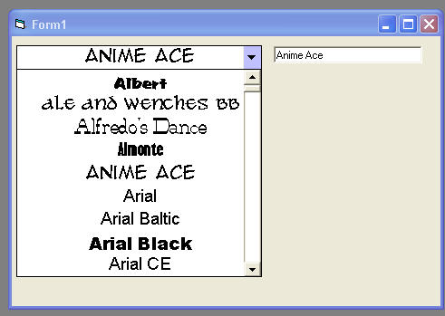



## Font Selector User Control

### Description

I tried to find a short,easy to use font selector, but had no luck .They were either long and complicated (slow) or needed an extra module.So I made this usercontrol.Its seems to work fine on my computer. Just need to know how it does on yours and any improvements are welcome.
 
### More Info
 

             |
---                |---
**Submitted On**   |2005-06-03 17:17:14
**By**             |[Kenneth Foster](https://github.com/Planet-Source-Code/PSCIndex/blob/master/ByAuthor/kenneth-foster.md)
**Level**          |Beginner
**User Rating**    |4.0 (12 globes from 3 users)
**Compatibility**  |VB 6\.0
**Category**       |[Custom Controls/ Forms/  Menus](https://github.com/Planet-Source-Code/PSCIndex/blob/master/ByCategory/custom-controls-forms-menus__1-4.md)
**World**          |[Visual Basic](https://github.com/Planet-Source-Code/PSCIndex/blob/master/ByWorld/visual-basic.md)
**Archive File**   |[Font\_Selec189689642005\.zip](https://github.com/Planet-Source-Code/kenneth-foster-font-selector-user-control__1-60887/archive/master.zip)

